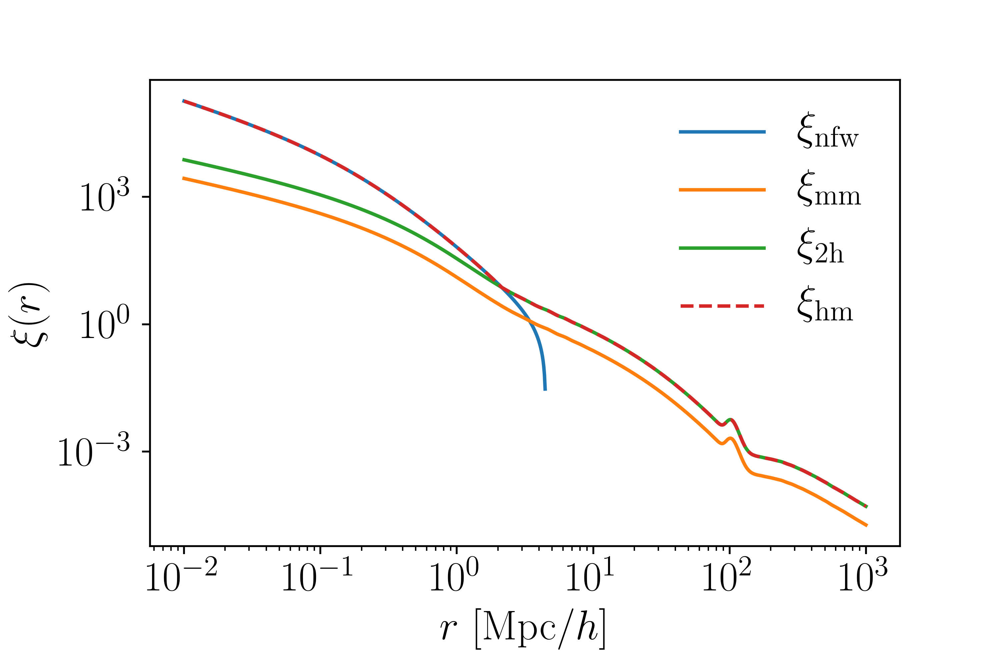

******************************
Correlation Functions
******************************

Cluster density profiles are closely related to the correlation function

.. math::
   
   \rho(r) = \bar{\rho}(1+\xi_{hm}(r))

That is, the average density of halos some distance :math:`r` from the center of the halo is proportional to mean density of the universe and the *halo-matter* correlation function, or the tendency to find matter near halos. This module makes various correlation functions available. The correlation functions for the NFW and Einasto profiles can also be computed directly from the density profiles by inverting the above equation.

.. note::

   By definition :math:`\int {\rm d}V\ \xi(\vec{r}) = 0`.

NFW Profile
===========

The NFW profile (`arxiv <https://arxiv.org/abs/astro-ph/9508025>`_) is a 3D correaltion function given by:

.. math::

   \xi_{nfw}(r) = \frac{\rho_{nfw}}{\Omega_m\rho_{crit}} - 1

The free parameters are the cluster mass :math:`M_\Delta` and concentration :math:`c_\Delta = r_\Delta/r_s`. In this module we choose to define the density with respect to the matter background density :math:`\Omega_m\rho_{crit}`. The scale radius :math:`r_s` is given in :math:`{\rm Mpc}/h`, however the code uses  as an argument instead. As written, because of the choice of units the only cosmological parameter that needs to be passed in is :math:`\Omega_m`. The arguments are identical to the density profile.

.. note::
   The correlation functions can use :math:`\Delta\neq 200` as an argument :code:`delta=200`.

To use this, you would do:

.. code::

   from cluster_toolkit import xi
   import numpy as np
   radii = np.logspace(-2, 3, 100) #Mpc/h comoving
   mass = 1e14 #Msun/h
   concentration = 5 #arbitrary
   Omega_m = 0.3
   xi_nfw = xi.xi_nfw_at_R(radii, mass, concentration, Omega_m)

Einasto Profile
===============

The Einasto profile (`ADS <http://adsabs.harvard.edu/abs/1965TrAlm...5...87E>`_) is a 3D density profile given by:

.. math::

   \xi_{ein}(r) = \frac{\rho_{ein}}{\Omega_m\rho_{crit}} - 1
   

In this model, the free parameters are the scale radius :math:`r_s`, :math:`\alpha`, and the cluster mass :math:`M_\Delta`. The scale density :math:`\rho_s` is calculated internally, or can be passed in instead of mass. This is the same arguments as the density profile. To use this, you would do:

.. code::

   from cluster_toolkit import xi
   import numpy as np
   radii = np.logspace(-2, 3, 100) #Mpc/h comoving
   mass = 1e14 #Msun/h
   r_scale = 1.0 #Mpc/h comoving scale radius
   alpha = 0.19 #arbitrary; a typical value
   Omega_m = 0.3
   xi_ein = xi.xi_einasto_at_R(radii, mass, r_scale, alpha , Omega_m)

1-halo vs. 2-halo Terms
=============================================

The NFW and Einasto profiles describe the "1-halo" density of halos, or the density of a halo within its boundary. However, halos tend to be found near other halos, and for this reason the *average density* of halos should have a 2-halo term. In other words, as you move far from the center of a halo (e.g. past the scale radius or :math:`r_{200}` or a splashback radius or any arbitrary boundary) the average density of halos becomes the average density of the matter density field times some bias.

.. math::

   \rho_h(r >> r_s) = \rho_{2-halo}(r)

or equivalently

.. math::

   \xi_hm(r >> r_s) = \xi_{2-halo}(r).

The two halo term, as detailed below, should be related to the matter density field and a bias. The specific treatment of this is not unanimously agreed upon.

Matter-matter Correlation Function
=============================================

The matter-matter correlation function describes the average density of matter.

.. math::

   \rho_m(r) = \bar{\rho}(1+\xi_{mm}(r)

By definition it is related to the matter power spectrum by a Hankel transform

.. math::
   
   \xi_{mm}(r) = \frac{1}{2\pi^2}\int_0^\infty {\rm d}k\ k^2 P(k) \frac{\sin kr}{kr}.

There is not consensus on what power spectrum to use. `Hayashi & White <https://arxiv.org/abs/0709.3933>`_ use the *linear* matter power spectrum, while `Zu et al. <https://arxiv.org/abs/1207.3794>`_ use the *nonlinear* matter power spectrum. Anecdotally, the former is generally better for lower mass halos and the latter is better for higher mass halos. Regardless of what you use, to call this you would do

.. code::

   from cluster_toolkit import xi
   import numpy as np
   radii = np.logspace(-2, 3, 100) #Mpc/h comoving
   #Assume that k and P come from somewhere, e.g. CAMB or CLASS
   xi_mm = xi.xi_mm_at_R(radii, k, P)

2-halo Correlation Function
=============================================

Halos are *biased* tracers of the matter density field, meaning the 2-halo correlation function is

.. math::

   \xi_{2-halo}(r,M) = b(M)\xi_{mm}(r)

The bias is described in more detail in the bias section of this documentation (in progress). To calculate the 2-halo term you would do

.. code::

   from cluster_toolkit import xi
   from cluster_toolkit import bias
   import numpy as np
   radii = np.logspace(-2, 3, 100) #Mpc/h comoving
   mass = 1e14 #Msun/h
   Omega_m = 0.3
   #Assume that k and P come from somewhere, e.g. CAMB or CLASS
   xi_mm = xi.xi_mm_at_R(radii, k, P)
   #Assume that k and P_linear came from somewhere, e.g. CAMB or CLASS
   bias = bias.bias_at_M(mass, k, P_linear, Omega_m)
   xi_2halo = xi.xi_2halo(bias, xi_mm)

Halo-matter Correlation Function
=============================================

At small scales, the correlation function follows the 1-halo term (e.g. NFW or Einasto) while at large scales it follows the 2-halo term. There is no consensus on how to combine the two. `Zu et al. <https://arxiv.org/abs/1207.3794>`_ take the max of the two terms, while `Chang et al. <https://arxiv.org/abs/1710.06808>`_ sum the two. The default behavior of this module is to follow `Zu et al. <https://arxiv.org/abs/1207.3794>`_, and in the near future it will be easy to switch between different options. Mathematically this is

.. math::

   \xi_{hm}(r,M) = \max(\xi_{1-halo},\xi_{2-halo}).

To use this you would do

.. code::

   from cluster_toolkit import xi
   #Calculate 1-halo and 2-halo terms here
   xi_hm = xi.xi_hm(xi_1halo, xi_2halo)

Here are each of these correlation functions plotted together:

