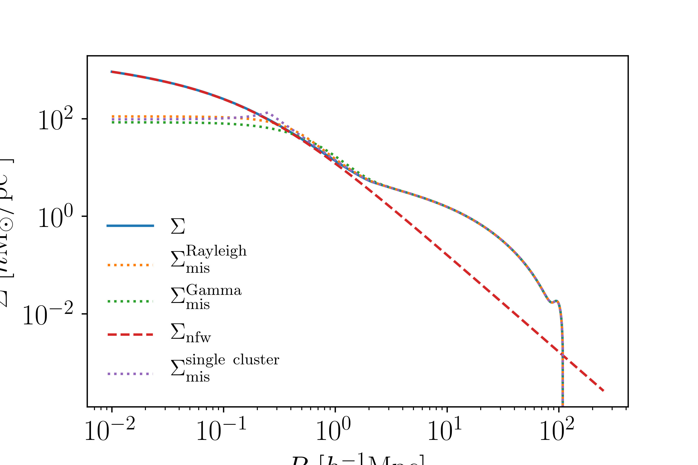
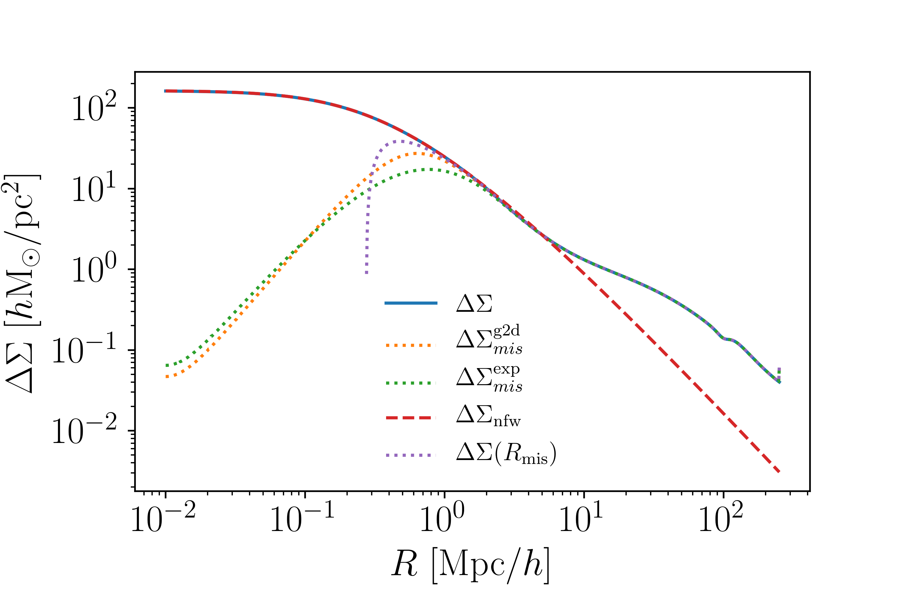

************************************************************************
Projected Density profiles :math:`\Sigma` and :math:`\Delta\Sigma`
************************************************************************

Weak lensing measurements of galaxy clusters involve calculating the projected and differential density profiles of the cluster.

Surface Mass Density :math:`\Sigma(R)`
=========================================

The projected density (or the surface mass density) is defined as

.. math::

   \Sigma(R) = \Omega_m\rho_{crit}\int_{-\infty}^{+\infty}{\rm d}z\ \xi_{hm}(\sqrt{R^2+z^2}).

Where :math:`\xi_{hm}` is the halo-matter correlation function (link to the correlation function documentation). The integral is along the line of site, meaning that :math:`R` is the distance on the sky from the center of the cluster.

.. note::
   :math:`\Sigma` and :math:`\Delta\Sigma` use units of :math:`{\rm M}_\odot h/{\rm pc}^2`, following convention in the literature.

.. note::
   This module is called :code:`cluster_toolkit.deltasigma`, even though it contains routines to calculate :math:`\Sigma` as well as :math:`\Delta\Sigma`.
	 
To calculate this using the module you would use:

.. code::

   from cluster_toolkit import deltasigma
   mass = 1e14 #Msun/h
   concentration = 5 #arbitrary
   Omega_m = 0.3
   R_perp = np.logspace(-2, 2.4, 100) #Mpc/h comoving; distance on the sky
   #Assume that radii and xi_hm are computed here
   Sigma = deltasigma.Sigma_at_R(R_perp, radii, xi_hm, mass, concentration, Omega_m)

NFW :math:`\Sigma(R)`
=====================

The example code above computes a :math:`\Sigma` given any halo-matter correlation function, but you can compute :math:`\Sigma_{nfw}` directly using

.. code::

   from cluster_toolkit import deltasigma
   mass = 1e14 #Msun/h
   concentration = 5 #arbitrary
   Omega_m = 0.3
   R_perp = np.logspace(-2, 2.4, 100) #Mpc/h comoving; distance on the sky
   Sigma_nfw = deltasigma.Sigma_nfw_at_R(R_perp, mass, concentration, Omega_m)

If you know of an analytic form of the the Einasto profile, please let me know.

Differential Surface Density :math:`\Delta\Sigma(R)`
===================================================================

The differential (or excess) surface mass density is defined as

.. math::

   \Delta\Sigma = \bar{\Sigma}(<R) - \Sigma(R)

where :math:`\Sigma` is given above and

.. math::

   \bar{\Sigma}(<R) = \frac{2}{R^2}\int_0^R {\rm d}R'\ \Sigma(R'),

or the average surface mass density over the circle enclosed by :math:`R`. To calculate this using this modele you would use

.. code::

   from cluster_toolkit import deltasigma
   mass = 1e14 #Msun/h
   concentration = 5 #arbitrary
   Omega_m = 0.3
   #Assume that Sigma at Rp is calculated here
   R_perp = np.logspace(-2, 2.4, 100) #Mpc/h comoving; distance on the sky
   DeltaSigma = deltasigma.DeltaSigma_at_R(R_perp, Rp, Sigma, Mass, concentartion, Omega_m)

As you can see, the code is structured so that the input :math:`\Sigma` profile is arbitrary.

.. note::
   Mass, concentration, and :math:`\Omega_m` are also arguments to :math:`\Delta\Sigma`, because an NFW profile is used to extrapolate the integrand for :math:`\bar{\Sigma}(<R)` at very small scales. To avoid issues when using an Einasto or other profile, make sure that the input profiles are calculated to fairly large and small scales.
   
This figure shows the different :math:`\Sigma(R)` profiles, including with miscentering

This figure shows the different :math:`\Delta\Sigma(R)` profiles, including with miscentering

